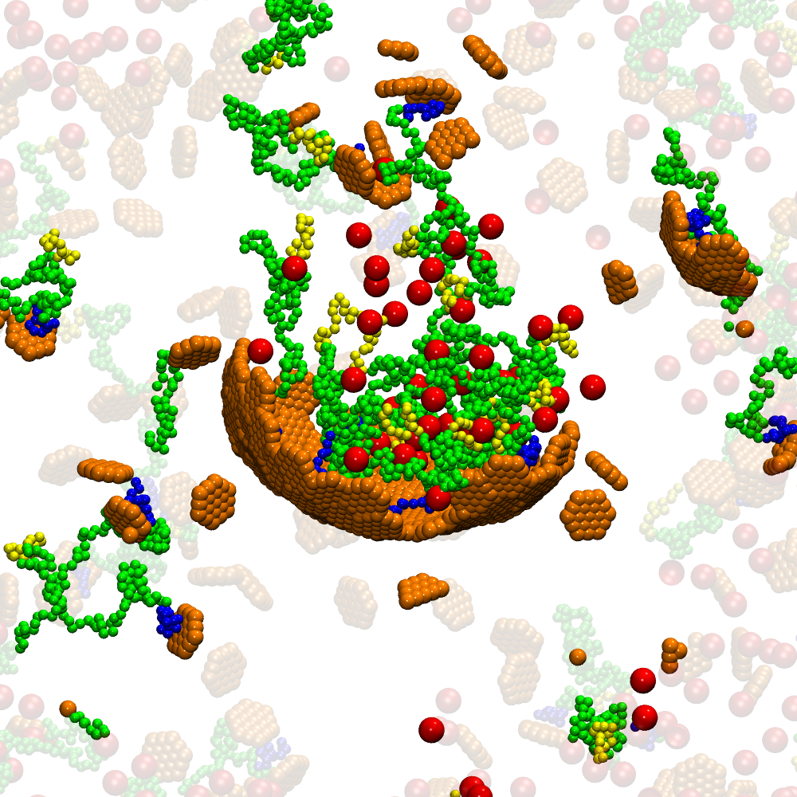

## TCL scripts for taking snapshots from molecular simulation trajectories 

#### Load the dcd trajectory
vmd sd*.mol2 sd*.dcd

#### In TKconsole:
>play take_snap.tcl

#### Go to last frame
>CapsidPolymer

#### Then go to the selected frame
#### Zoom in and make the view as desired

#### Then 
>display resize 1000 10000
>Capsidpolymer

#### Choose a frame number as part of the filename
>onesnap framenumber

#### To convert tga files to jpg:
#### Close vmd
#### In the folder that you have tga files run 
>bash convert.sh

